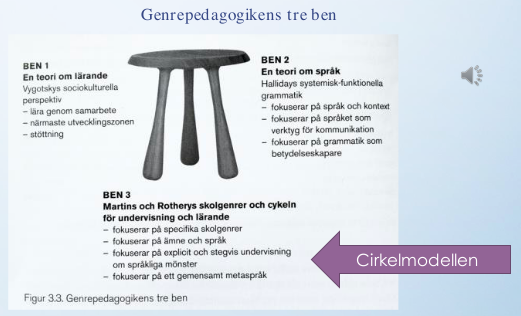

<!--

*Inom andraspråksforskning förespråkas undervisning som utmärks av ett språk- och kunskapsutvecklande arbetssätt. Redogör för innebörden av ett språk-och kunskapsutvecklande arbetssätt samt för bakomliggande teorier och forskning. Diskutera hur andraspråksundervisningen kan utformas så att den stöttar elevernas språk- och kunskapsutveckling samt belys med exempel. Ta stöd i relevant styrdokument i din diskussion.*

*Redovisa samt motivera dina tankar och förslag genom att referera till kurslitteratur och eventuellt annan relevant litteratur. Ett allmänt tyckande utan hänvisning till litteratur godkännes ej.*
<!-- Vilka kapitel förväntas jag läsa i kurslitteraturen? 
Skolverket: Kurs-/ämnesplaner
Skolverket: Greppa språket
Skolverket: Greppa flerspråkigheten
I Gibbons: Kapitel 2, 6, 7 och 8 (främst)
I Hyltenstam: Kapitel 5, 6, 8, 19, 20, 26
I Kästen-Ebeling & Otterup: Kapitel 2, 3, 5, 6, 7 och 11 

+ Eventuellt ta något exempel ur Mörlings bok om analfabeter

* Grundar sig i en teori om att det är språket som bär kunskapen; att det handlar om att förvärva olika litteraciteter och att det i skolan handlar om att stötta eleverna till att gå från vardagsspråk till ett skolspråk och ett mer ämnesspecifikt skolspråk... att så att säga vidga deras register. Här kommer Vygotskij in eftersom

-->

### Vad är ett språk- och kunskapsutvecklande arbetssätt ?

Inom andraspråksforskning förespråkas sedan en tid tillbaka att undervisning i skolan bör bedrivas utifrån ett så kallat *språk- och kunskapsutvecklande arbetssätt* [@skolverket2012]. Det innebär enligt den australiensiska forskaren Pauline Gibbons (1946-) att undervisningen sker på ett sätt så att "språket ständigt sätts i fokus i alla ämnen och där språk och innehåll integreras så att språket utvecklas parallellt med ämneskunskaperna" [@gibbons2013, s. 33].

Det är en pedagogik och ett synsätt som skiljer sig från den mer traditionella där elevernas språkutveckling främst var något som ansågs vara ett ämne för lektionerna i språk, medan undervisningen i till exempel NO och SO var inriktad på att lära ut ämnesspecifika teorier och förklaringsmodeller (ref). Här har det dock skett en förändring och i en av Skolverkets skrifter står nu att läsa följande när det gäller synen på språkets betydelse för lärande:

> ”*Om alla lärare har en medvetenhet om språkets betydelse för lärandet och verktyg för att på bästa sätt möta elevernas behov, har fler elever möjlighet att nå de kunskapskrav som kursplanerna ställer. För att utveckla skolan till en språk- och kunskapsutvecklande miljö krävs att alla bidrar på olika sätt.*” [@skolverket2012, s. 133]

### Vilka forskning ligger till grund för förordandet av detta arbetssätt?
 
I huvudsak tre teorier ligger till grund för den förändrade synen på språkets betydelse för lärandet (ref). Gemensamt för dessa teorier, som jag snart ska beskriva mer utförligt, att de fokuserar på det sammanhang där andraspråket används och utvecklas. Under den senare delen av 1900-talet väcktes inom språkforskning generellt - men även andraspråksforskning specifikt - kritik inom mot vad som ansågs vara en alltför kausal, mekanisk och individcentrerad syn på språkutveckling, och där man ansåg att det sociala och kulturella sammanhang där språket användes och utvecklades hittills inte betonats tillräckligt (kap. 17, s. 490).

Den första teorin som utgjort en form av teoretisk språngbräda för sociologiskt inriktad andraspråksforskning, är den rysk-judiske pedagogen och filosofen Lev Vygotskijs (1896-1934), sociokulturella teori om att lärande sker genom samspel och med hjälp av stöttning i den så kallade närmaste utvecklingszonen [@vygotskij2001]. Vygotskij hävdade att det fanns ett glapp mellan den kunskapsmässiga nivå som en elev behärskar och den nivå som eleven har möjlighet att lära sig. Den senare nivån benämnde han *den närmaste utvecklingszonen*, och menade vidare att den nivån kan nås i samspel med mer kunniga elever eller lärare och med hjälp av olika sociala och kulturella redskap såsom det talade och skrivna språket men även t.ex. gester och bilder. Det är genom dessa redskap som kunskap kommuniceras eller *medieras*, hävdade han (kap. 21, s. 210). Enligt Vygotskijs synsätt utgör alltså deltagandet i socialt och kulturellt specifika gemenskaper, s.k. *praktiker* grunden för erövrandet av såväl ett språk som kunskap inom ett visst område. Med denna teori som utgångspunkt har andraspråksforskare i studier påvisat vikten av moment i undervisningen där eleverna lär varandra genom att i olika samarbetsformer ta sig an en uppgift, och där läraren intar en mer stöttande roll i elevernas ömsesidiga lärande snarare än en att enkom utgör en auktoritet som står bakom katedern och förkunnar. Mer specifikt kopplat till andraspråksforskningen X är en forskare som utgått från Vygotskijs teori. Hon har stöttning.

Den andra teorin som ligger till grund för förordandet av ett språk- och kunskapsutvecklande arbetssätt inom skolundervisningen är språkforskaren Michael Hallidays (1925-2018) systematisk-funktionella grammatik (SFG) [@halliday1993]. Halliday tog i skapandet av sin teori avstamp i den grundläggande frågan om vad språk egentligen fyller för funktion i mänsklig tillvaro. Det han kom fram till var att språket lämpligast kan uttryckas som utgörande ett socialt system inom vilket vi människor rör oss och där vi hela tiden ställs inför olika valmöjligheter att uttrycka oss på det ena eller andra sättet i syfte att försöka skapa mening och ömsesidig förståelse kring den verklighet vi möter. 

Centralt för att lära sig behärska ett språk är enligt Halliday därmed också att lära sig grammatiken för detta system och med hjälp av denna 'metakunskap' lära sig att uttrycka sig på ett adekvat sätt givet en viss kulturell kontext och en viss situation. Kontexten för språkanvändning, enligt Halliday utgörs alltså dels av den kulturella kontexten och dels av situationskontexten. Den kulturella kontexten kan för att bli lite mer konkret sägas utgöras av olika sociala praktiker, och när det kommer till den språkanvändning som utmärker en viss social praktik så benämner Halliday den *genre*. Att lära sig språkanvändningen i en viss social praktik är alltså, för att tala med Halliday, att lära sig språkbruket i en viss *genre*. Australiensiska språkforskare har i Hallidays efterföljd vidareutvecklat hans teoribygge, lyft abstraktionsnivån ytterligare ett snäpp och talar om *genrefamilj* (ref). Skolans textvärld menar de består av tre genrefamiljer: Engagerande genrer (berättelser); informerande genrer (fakta) och värderande genrer (argument och textresponser) (ref). För att kunna läsa, analysera och skriva alla de olika typer av texter som förekommer i skolan krävs alltså att man lär sig hur språket ska användas i alla dessa genrefamiljer med tillhörande genrer. 

Men inte nog med det utan adekvat språkanvändning kräver även en förståelse för den situationella kontexten. Tre variabler påverkar enligt Halliday språkanvändningen i en viss situation: ämnet eller aktiviteten (t.ex. en laboration i kemi); förhållningssättet mellan de involverade i den kommunikativa händelsen (t.ex. två jämbördiga elever) och slutligen den roll språket spelar i denna interaktion (t.ex att språket syftar till att säkerställa att laborationen utförs enligt anvisningarna). Det är dessa tre variabler som tillsammans påverkar valet av vilket *register* som är adekvat att använda i en viss situation, t.ex. ett mer informellt vardagspråk eller ett mer ämnesspecifikt och formellt skolspråk. I anslutning till litteraciteter

<!--
Med utgångspunkt i Hallidays teori utgör ålet med undervisningen är att utvidga elevernas reportoarer av sådana språkliga register så att de kan anpassa sitt språkbruk efter varierande situationskontexter från vardagliga till mer språkligt utmanande.
-->

Den tredje och sista teori som ligger till grund för den förändrade synen på språkets betydelse för lärandet  har att göra med skolans rättvise- och jämlikhetsambitioner. Här menar Bernstein (ref) att skolan återspeglar den kunskapssyn och de värderingar som finns hos medelklassen och att detta utgör 

<!--

 + Teori om närmaste utvecklingszonen. Här kan man komma in på vardagsspråk och skolspråk, litteracitet, och också på stöttning. Detta är kopplat till Gibbons tankar om betydelsen av "stöttning".

När det gäller Halliday har den teorin haft betydelse  handlar det om att kunna utveckla ett metaspråk tillsammans och att lärare och elever tillsammans därigenom kan prata explicit om språkets struktur och att lära sig olika texttyper...hur språket används i olika sammanhang... Det handlar om att förstå att skolspråket inte är ett enda utan att språket har olika funktioner, såsom att det kan syfta till att berätta och förklara, etc...

Enligt en forskningssammanställning gjord av Meltzer och Hamman har följande visat sig gynnsamt för elevers lärande i alla ämnen [-@skolverket2012, s. 12-13]  

* 1. Läraren betonar läsning, skrivande, muntlig framställning, lyssnande och visualiseringar
* 2. Läraren betonar tankemässigt krävande uppgifter
* 3. Läraren känner till och kan analysera språket i sitt ämne
* 4. läraren fokuserar på en medveten utveckling av ordförrådet i ämne
* 5. Läraren förstår vilka texter som är ämnestypiska och vad som kännetecknar dem
* 6. Läraren undervisar om vad som utmärker olika texter i ämnet och också om olika lärandestrategier och använder olika typer av formativ bedömning av elevernas prestation
* 7. Läraren skapar en elevcentrerad klassrumsmiljö

Nummer 1 är kopplat till att det är viktigt att eleverna inte är passiva lyssnare utan aktiva och att de for använda sig av en variation av sinnen och förmågor för att stärka sitt språk och sin kunskap - kopplat till Vygotskijs tankar om lärling och att skolas in i ett sammanhang på flera sätt och med fokus på att vara aktiv och att skapa tillsammans och på egen hand. Nummer 2. är kopplat till kognitiv kvalitet - stöttning och Vygotskij. Nummer 3-4 bygger på insikter utifrån Vygotskijs teorier om språkets centala roll för kunskap men också Hallidays tankar om metaspråk. Nummer 5 kan kopplas till Vygotskij om vilket språk som utmärker en viss praktik samt till Hallidays tankar om metaspråk. Nummer 6 kan nog kopplas till Halliday också... Nummer 7 till Vygotskij igen..

### Hur kan detta arbetssätt omsättas från teori till praktik?

Hur omsätta detta i praktiken? Jo, genom genrepedagogik som bland annat Gibbons refererar till - består av sociokulturell teori + Halliday + ett tredje ben, i from av en modell: cirkelmodellen som beskriver hur de två teorierna omsätts i praktiken. Det är en modell som väldigt explicit visar hur man kan handleda eleverna i skolspråket. Genom att titta på hur texter fungerar och alltså vad som egentligen görs i språket och gå igenom det innan man förväntas skriva sådana texter på egen hand. Också en demokratisk fråga för elever i en akademisk familj där kanske man pratar om sådana saker och man förvärvar den litteraciteten hemma, men för elever som inte har den miljön hemma så krävs det att man tar upp och dekonstruerar texttyper på detta sätt för att de ska ges en chans att förstå och förmå erövra en sådan litteracitet och alltså lära sig att skriva på det sättet.

* Ett sätt att synligöra vad det är vi gör med språket

Förutsättningen för att läraren ska kunna arbeta med ett "språk- och kunskapsutvecklande arbetssätt" är att hen tar reda på elevernas förkunskaper. Det kan enligt Greppa språket [-@skolverket2012, s. 94] göras genom en blandning av:

* Helklassamtal
* Gruppsamtal 
* Individuellt kortskrivande
* Tankekartor
* Det här vet jag om X/ Det här tror jag om X/ Det här skulle jag vilja veta om X
* Hemuppgift att ta reda på mera om...

Vidare görs detta lämligen enligt Gibbons [-@gibbons2018, s. 140-141] genom att hos eleverna bygga upp en förförståelse för ämnet i fråga. Vilket hon menar lämpligen görs genom att låta dem:

* Sammanfatta innehållet med ett språk som eleverna förstår och presentera centrala begrepp
* Sammanfatta varje stycke
* Peka på kärnmeningen i varje stycke
* Arbeta först med begreppen och sedan läsa texten
* Ta hjälp av modersmålet
* Ta hjälp av bilder
* Ta hjälp av annan media, t.ex. film innan de läser texten

Här handlar det alltså om att låta dem förbereda sig på de begrepp och det innehåll som ska komma genom att ta hjälp av de får använda sig av enklare synonymer, sitt modersmål och andra modus såsom t.ex. rörlig bild för att "greppa" språket.

I PPT-presentationen ges andra exempel nämligen:

* Textdekonstruktion. En text text dekonstrueras efter struktur och språkliga drag med början i rubriken, därefter bakgrund, tes, argument, motargument, osv.
* Dictogloss [@gibbons2018, s. 109]: Innehåll och form; Lära genom varandra
* Post-it-lappar på tavlan [@gibbons2018, s. 108]; Möjlighet att få tänka innan man pratar; Alla får komma till tals
* Sista ordet [@gibbons2018, s. 113]: Ett "reglerat samtal"; Alla får komma till tals.

<!--

### Redogör för vad ett "språk- och kunskapsutvecklande arbetssätt" innebär

### Vilka är de bakomliggande teorierna och forskningen?
*Alltså de teorier och den forskning som stöder detta arbetssätt*

De teorier och den forskning som ligger till grund för att detta är "språk och kunskapsutvecklande arbetssätt" som alltså förordas av Skolverket är bland annat 
Det som också ligger till grund för detta arbetssätt är forskning om **modersmålets roll**. Detta har att göra med **transspråkande/translanguaging** (Cummin, 1997):

* Bygger på teorin om en underliggande språkförmåga
* Strukturer och fenomen kan överföras mellan språk
* Att undervisa med ett transspråkande perspektiv: arbeta systematiskt för att utveckla flerspråkighet, utveckla elevernas samtliga språk till skolspråk
* Social rättvisa: Alla språk har samma värde (Garcia, 2019)
* Social praktik: Undervisningen ska innehålla meningsfulla sammanhang med tydliga strategier för hur flerspråkiga resurser kan användas (Garcia, 2019)
* Elevens starkaste språk används systematiskt och strategiskt i undervisningen för att utveckla flerspråkighet och identitet

Här påtalas av någon (hämtat från slide) att grupparbete är bra, men kräver genomtänkta, kognitivt krävande uppgifter: **Utvecklande samtal**

Centrala begrepp utifrån Vygotskijs teori är också **stöttning** och den  **närmaste utvecklingszonen** [@skolverket2012, s. 28] och här påtalas i en slide när det gäller stöttning att uppgifterna i Gibbons bok + **interaktiv stöttning** [@gibbons2018, s. 226] är att beakta. Det handlar om att lyssna efter vad eleverna försöker säga, ge eleverna mer tid att svara, invänta, sammanfatta med akademiska termer, m.m. När det gäller närmaste utvecklingszonen handlar det om att uppgifterna inte får vara för svåra och inte för lätta.

#### Kognitiv kvalitet

När det gäller teorier som ligger till grund för detta arbetssätt så bottnar det också om tankar om **kognitiv kvalitet** [@gibbons2018, s. 39 (Definition av Newman (1996), USA, Storbritannien)]. Det handlar om:

* **Kunskapsbyggande**: sammanfatta, sammanställa info från olika källor och använda i ny kontext (jmf. Cummins fyrfältsmodell) såsom att t.ex. läsa fakta om staden X och sedan regissera ett teveprogram om staden eler skriva ett faktablad om staden för nyanlända.
* **Ämnesrelaterade undersökningar**: att använda tidigare kunskaper, utveckla djupförståelse och kunna uttrycka egna idéer genom att göra ett reportage eller skriva en insändare. 
* **Verklighetsanknutet lärande**

Enligt Gibbons [-@gibbons2018, s. 40] kan **kognitiv kvalitet** enligt en definition i Australien utgöras av:

1. Kritiskt tänkande
2. Djupkunskap/ djupförståelse
3. Utvecklande samtal

Med **kognitivt krävande uppgifter** menar Gibbons [-@gibbons2018, s. 47-77]:

* Uppgifter utan tak (problembaserade, kräver djupförståelse och kunskaper inom fler ämnen, verklighetsanknutna, kräver insamling, sammanställning, bearbetning av mkt info, kräver utvecklande samtal, m.m.)
* Autentiska uppgifter
* Lärlingskap (jfr. Vygotskij)
* Synliggöra tänkandet

När det kommer till **utvecklande samtal** innefattar det enligt Gibbons [-@gibbons2018, s. 209]:

- Uppgift som **kräver samtal** (jfr. *möjliggör* samtal)
- Uppgift som **integreras** i ett vidare, komplext sammanhang (som en del i ett tema/arbetsområde)
- Uppgift med **autentisk** karaktär
- Uppgift som **engagerar**, med relevans för eleverna
- Uppgift med tydligt **syfte**
- Uppgift som är **kognitivt** utmanande
- Uppgift med **informationsgap**
- Uppgift som kräver allas **deltagande**

#### Genrepedagogikens tre ben

#### Cirkelmodellen

1. Bygg upp en gemensam begrepps- och kunskapsbank inom ämnesområdet
2. Modellera genren (syfte, uppbyggnad, språkliga drag, läs modelltexter) <!-- När man dekonstruerar på detta sätt lär man sig också att förstå att det finns olika texttyper och de har olika struktur och olika språkliga drag nämligen: 1. Återberättande (när vi berättar vad som har hänt); 2. Narrativ (som också berättar men där det finns en konflikt); 3. Beskrivande (en beskrivning av någonting); 4. Förklarande (som förklarar hur någonting fungerar eller vad som händer); 5. Argumenterande 
3. Skriv gemensamt texten
4. Skriv självständigt

### Hur kan andraspråksundervisningen utformas så att den stöttar elevernas språk- och kunskapsutveckling?

*Här förväntas jag belysa detta med exempel samt ta stöd i relevanta styrdokoment.*

<!-- https://www.andrasprak.su.se/om-oss/vanliga-fr%C3%A5gor/grundskola/vad-%C3%A4r-genrepedagogik-1.96361 -->
<!-- https://www.andrasprak.su.se/om-oss/vanliga-fr%C3%A5gor/grundskola/vad-%C3%A4r-spr%C3%A5k-och-kunskapsutvecklande-arbetss%C3%A4tt-1.96386 -->
