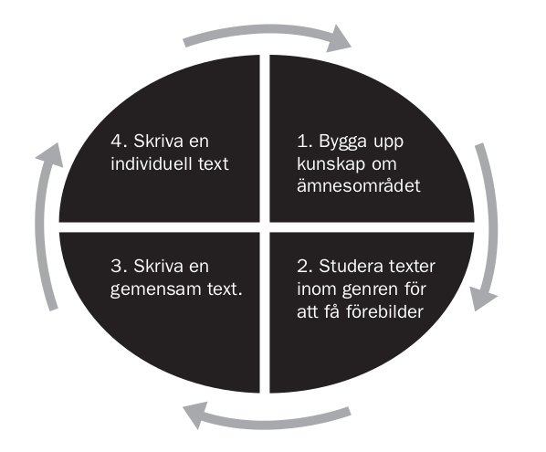

### Vad är ett språk- och kunskapsutvecklande arbetssätt ?

Inom andraspråksforskning förespråkas sedan en tid tillbaka att undervisning i skolan bör bedrivas utifrån ett så kallat *språk- och kunskapsutvecklande arbetssätt* [@skolverket2012]. Det innebär enligt den australiensiska forskaren Pauline Gibbons (1946-) att undervisningen sker på ett sätt så att "språket ständigt sätts i fokus i alla ämnen och där språk och innehåll integreras så att språket utvecklas parallellt med ämneskunskaperna" [@gibbons2013, s. 33].

Det är en pedagogik och ett synsätt som skiljer sig från vad traditionen anger, där elevernas språkutveckling främst antas vara ett ämne för lektionerna i språk, medan undervisningen i till exempel NO och SO var inriktad på att lära ut ämnesspecifika teorier och förklaringsmodeller. Här har det dock skett en förändring och i en av Skolverkets skrifter står nu att läsa följande när det gäller synen på språkets betydelse för lärande:

> ”*Om alla lärare har en medvetenhet om språkets betydelse för lärandet och verktyg för att på bästa sätt möta elevernas behov, har fler elever möjlighet att nå de kunskapskrav som kursplanerna ställer. För att utveckla skolan till en språk- och kunskapsutvecklande miljö krävs att alla bidrar på olika sätt.*” [@skolverket2012, s. 133]

### Vilka forskning ligger till grund för förordandet av detta arbetssätt?
 
För att förstå varför språket har tilldelats en mer framträdande roll i undervisningen på senare tid är det nödvändigt att belysa de två teorier som bland annat Gibbons grundar sin forskning på. Det är Lev Vygotskijs (1896 - 1934) teori om lärande [@vygotskij2001] och Michael Hallidays teori om språk [@halliday1993].

I sin teori om lärande beskriver Vygotskij att det fanns en klyfta mellan den kunskapsmässiga nivå som en person behärskar och den nivå som en person har möjlighet att lära sig. Den senare nivån benämnde han *den närmaste utvecklingszonen*, och argumenterade vidare för att den nivån kan nås genom stöd från eller samarbete med mer kunniga personer inom området och med hjälp av olika sociala och kulturella redskap, såsom till exempel talspråk, skriftspråk, gester och bilder. Genom dessa redskap kommuniceras eller *medieras* kunskap och möjliggör att “vad barnet kan göra i samarbete i dag kan det göra på egen hand i morgon” [@vygotskij2001, s. 186].

Det stöd eller det samarbete som krävs för att nå den närmaste utvecklingszonen har inom dagens pedagogiska litteratur fått namnet *stöttning* och beskrivs av Gibbons som ”en tillfällig handledning av elever mot nya begrepp, högre nivåer av förståelse samt ett nytt språk” [@gibbons2018, s. 42] och är alltså en insats från lärarens sida som syftar till att eleven i fortsättning kan klara av uppgiften på egen hand.  I nära anslutning till stöttning hör också enligt Gibbons begreppet *hög kognitiv utmaning* som utgörs av uppgifter som vi inte lyckas lösa utan hjälp [@gibbons2018]. När eleverna arbetar med uppgifter som utgör en hög kognitiv utmaning men samtidigt ges en hög stöttning så arbetar de per definition i den närmaste utvecklingszonen enligt Gibbons [-@gibbons2018].

Den andra teorin som ligger till grund för förordandet av ett språk- och kunskapsutvecklande arbetssätt inom skolundervisningen är språkforskaren Michael Hallidays (1925 - 2018) *systematisk-funktionella grammatik* (SFG) [@halliday1993]. Halliday tog, i skapandet av sin teori, avstamp i frågan om vad språket fyller för funktion och konstaterade då att språket lämpligast kan uttryckas som utgörande ett relationellt system vi människor använder oss av och inom vilket vi hela tiden ställs inför olika valmöjligheter att uttrycka oss på det ena eller andra sättet i syfte att försöka skapa mening och ömsesidig förståelse kring den verklighet vi möter.

Centralt för att lära sig behärska ett språk är enligt Halliday därmed också att lära sig grammatiken för detta system och med hjälp av denna 'metakunskap' lära sig att uttrycka sig på ett adekvat sätt givet en viss kulturell kontext och en viss situation. Den kulturella kontexten kan, menade Halliday, i sin tur sägas utgöras av diverse olika sociala praktiker, och den språkanvändning som utmärker en viss social praktik utgör då en viss *genre*. Att lära sig språkanvändningen i en bestämd social praktik är alltså, för att tala med Halliday, att lära sig språket i en viss *genre*. Australiensiska språkforskare har i Hallidays efterföljd vidareutvecklat hans teoribygge, lyft abstraktionsnivån ytterligare och talat om *genrefamilj* [@kuyumcu2017]. Skolans textvärld menar de består av tre genrefamiljer: Engagerande genrer (berättelser); informerande genrer (fakta) och värderande genrer (argument och textresponser) [@kuyumcu2017]. För att kunna läsa, analysera och skriva alla de olika typer av texter som förekommer i skolan krävs alltså utifrån denna förklaringsmodell att man lär sig hur språket ska användas i alla dessa genrefamiljer med tillhörande genrer. 

Därtill kräver en adekvat språkanvändning även en förståelse för den situationella kontexten. Tre variabler påverkar enligt Halliday språkanvändningen i en viss situation: ämnet eller aktiviteten (t.ex. en laboration i kemi); förhållningssättet mellan de involverade i den kommunikativa händelsen (t.ex. två jämbördiga elever) och slutligen den roll språket spelar i denna interaktion (t.ex att språket syftar till att säkerställa att laborationen utförs enligt anvisningarna) [@halliday1993]. Det är dessa tre variabler som tillsammans påverkar valet av vilket *register* som anses adekvat att använda i en viss given situation, t.ex. ett mer informellt *vardagsspråk* eller ett mer ämnesspecifikt och formellt *skolspråk* [@halliday1993; @kuyumcu2017]. Ett angränsande begrepp till register är *litteracitet* (och förvärvandet av olika litteraciteter) men det har vanligtvis en vidare betydelse som utöver skrivet och talat språk även bl.a. inbegriper förmågan att tolka bilder, lootyper och symboler och även grundläggande matematiska färdigheter [@franker2017]. 

Hallidays teori om språk belyser vikten av att, som elev, ges möjlighet och tillfälle att utveckla en bred uppsättning register för att kunna tillgodogöra sig kunskap i de olika skolämnena för att på så vis utveckla ett fullödigt skolspråk. Här visar också forskning att elever från studievana hem tenderar att få ett försprång när det kommer till att behärska det mer formella skolspråket eftersom de ofta ges möjlighet att träna det även i sin hemmiljö till skillnad från övriga elever [@gibbons2018].

En forskningssammanställning gjord av Meltzer och Hamman [@meltzer2005] visar också att när lärare lägger större vikt vid språket i sin undervisning är det något som gagnar eleverna . Följande har nämligen visat sig gynnsamt för elevers lärande i alla ämnen enligt sammanställningen [@meltzer2005; @skolverket2012]:

1. Läraren betonar läsning, skrivande, muntlig framställning, lyssnande och visualiseringar
2. Läraren betonar tankemässigt krävande uppgifter
3. Läraren känner till och kan analysera språket i sitt ämne
4. Läraren fokuserar på en medveten utveckling av ordförrådet i ämne
5. Läraren förstår vilka texter som är ämnestypiska och vad som kännetecknar de
6. Läraren undervisar om vad som utmärker olika texter i ämnet och också om olika lärandestrategier och använder olika typer av formativ bedömning av elevernas prestation
7. Läraren skapar en elevcentrerad klassrumsmiljö

Med andra ord finns det stöd i forskningen för en undervisning som lägger större vikt vid språket, men hur gör man som lärare för att använda sig av ett språk- och kunskapsutvecklande arbetssätt i praktiken? Ett sätt kan vara att använda sig av så kallad genrepedagogik [@johansson2010; @kuyumcu2017].

### Genrepedagogik

Genrepedagogiken vilar på tre ”ben”, varav två redan omnämnts nämligen Vygotskijs teori om lärande och Hallidays teori om språk. Det tredje benet utgörs av en pedagogisk modell benämnd cykeln för undervisning och lärande och även kallad cirkelmodellen (se fig. 1). 

Denna modell beskriver hur dessa båda teorier kan omsättas i praktiken i den flerspråkiga undervisningssituationen. Det handlar initialt om att tillsammans bygga upp kunskap om ämnesområdet i fråga. Det kan till exempel göras genom ett gemensamt helklassamtal med öppna frågor om området, eller genom individuellt kortskrivande där eleverna ombeds besvara motsvarande frågor skriftligt och sedan föra samtal utifrån vad elevernas förkunskaper för att på så viss tillsammans bygga upp kunskap om ämnet [@skolverket2012]. Härnäst handlar det om att studera texter inom genren för att få förebilder. Syftet är här att hjälpa till att bygga upp textens ämnesområde samt att introducera en del av språket så att eleverna kan ha det med sig när de börjar att läsa [@gibbons2018]. Det här kan till exempel göras genom att som lärare följa samma struktur som originaltexten men sammanfatta innehållet med ett språk som eleverna förstår och presentera centrala begrepp. Det kan också handla om att peka på kärnmeningen i respektive stycke eller att förse de elever som kan läsa på sitt modersmål med en tvåspråkig version av texten. I nästa skede handlar det om att läraren och eleverna skriver en gemensam text tillsammans i den aktuella genren. Här betonar Gibbons [-@gibbons2018] att det är viktigt att föra en dialog kring giltigheten och relevansen i informationen och innehållet och att diskutera sinsemellan om språket är adekvat för texten. I det fjärde och sista steget uppmanas eleverna sedan att skriva en individuell text i den aktuella genren. 

Gibbons [-@gibbons2018] betonar att cirkelmodellens samtliga fyra steg inte alltid behöver gås igenom utan är avsedd för flexibel användning och när elever är bekanta med en viss genre kan man kanske hoppa över steg 2 och 3 eller gå igenom dem på ett mer övergripande sätt. Dock är det alltid viktig att försäkra sig om att eleverna har tillräckliga ämneskunskaper (steg 1).  
